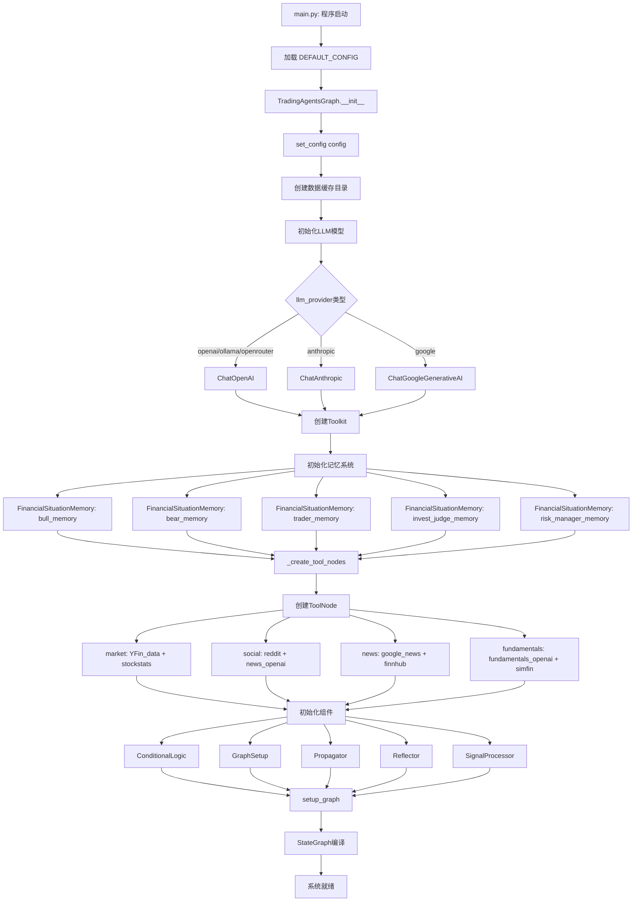

 # 1. 程序初始化阶段流程图

## 关键函数和类说明：

### 主要类：
- **TradingAgentsGraph**: 主控制器类
- **GraphSetup**: 图构建类
- **Propagator**: 状态传播类
- **ConditionalLogic**: 条件逻辑类
- **Reflector**: 反思学习类
- **SignalProcessor**: 信号处理类

### 关键函数：
- `TradingAgentsGraph.__init__()`: 初始化主控制器
- `_create_tool_nodes()`: 创建工具节点
- `GraphSetup.setup_graph()`: 设置代理图
- `set_config()`: 设置配置

### 记忆系统：
- `FinancialSituationMemory`: 财务情况记忆类
- 包含5个记忆实例：bull_memory, bear_memory, trader_memory, invest_judge_memory, risk_manager_memory

### 工具节点：
- **market**: YFin数据 + StockStats指标
- **social**: Reddit数据 + OpenAI新闻
- **news**: Google News + Finnhub新闻
- **fundamentals**: OpenAI基本面 + SimFin财务报表