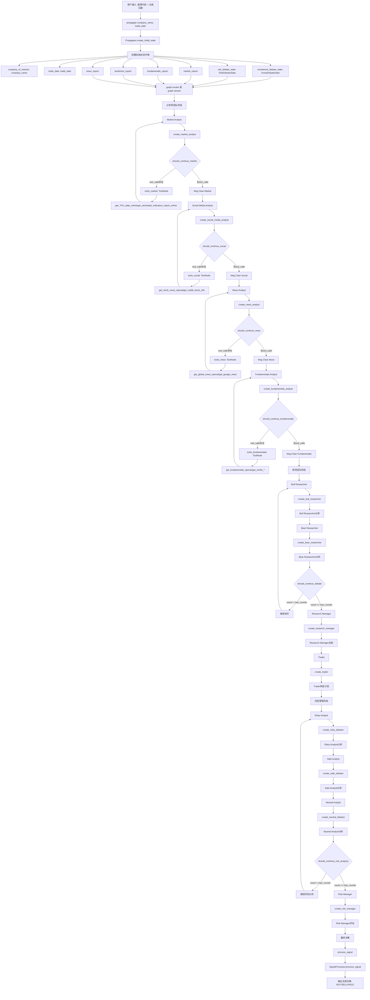

 # 2. 主要运行流程

## 关键函数和类说明：

### 主要函数：
- `TradingAgentsGraph.propagate()`: 主要传播函数
- `Propagator.create_initial_state()`: 创建初始状态
- `Propagator.get_graph_args()`: 获取图参数

### 分析师创建函数：
- `create_market_analyst()`: 创建市场分析师
- `create_social_media_analyst()`: 创建社交媒体分析师
- `create_news_analyst()`: 创建新闻分析师
- `create_fundamentals_analyst()`: 创建基本面分析师

### 研究员创建函数：
- `create_bull_researcher()`: 创建多头研究员
- `create_bear_researcher()`: 创建空头研究员
- `create_research_manager()`: 创建研究经理
- `create_trader()`: 创建交易员

### 风险分析师创建函数：
- `create_risky_debator()`: 创建激进分析师
- `create_safe_debator()`: 创建保守分析师
- `create_neutral_debator()`: 创建中性分析师
- `create_risk_manager()`: 创建风险经理

### 条件逻辑函数：
- `should_continue_market()`: 市场分析继续条件
- `should_continue_social()`: 社交媒体分析继续条件
- `should_continue_news()`: 新闻分析继续条件
- `should_continue_fundamentals()`: 基本面分析继续条件
- `should_continue_debate()`: 辩论继续条件
- `should_continue_risk_analysis()`: 风险分析继续条件

### 状态类：
- `InvestDebateState`: 投资辩论状态
- `RiskDebateState`: 风险辩论状态