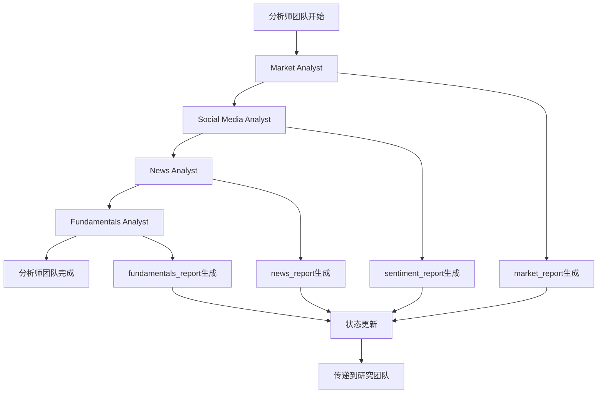
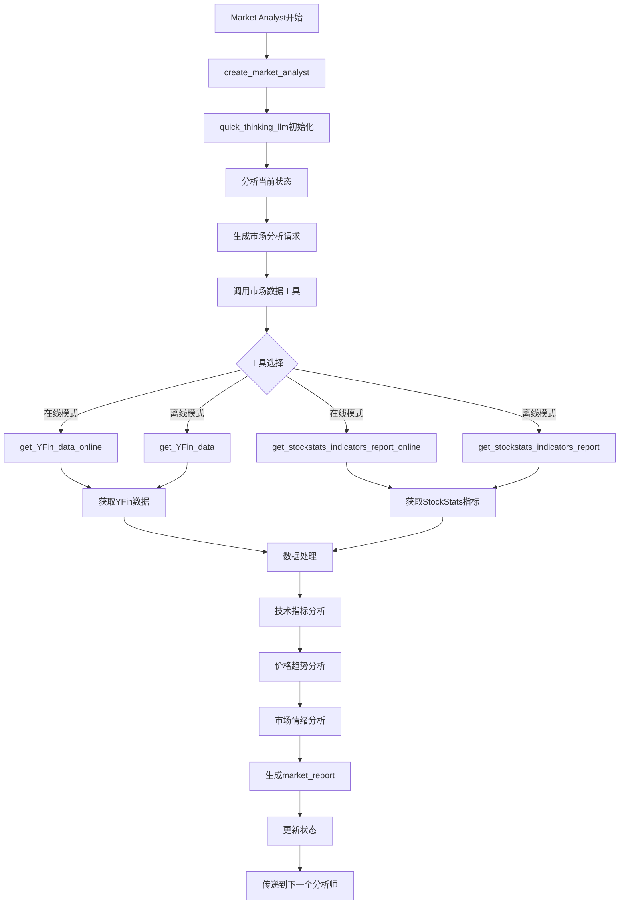
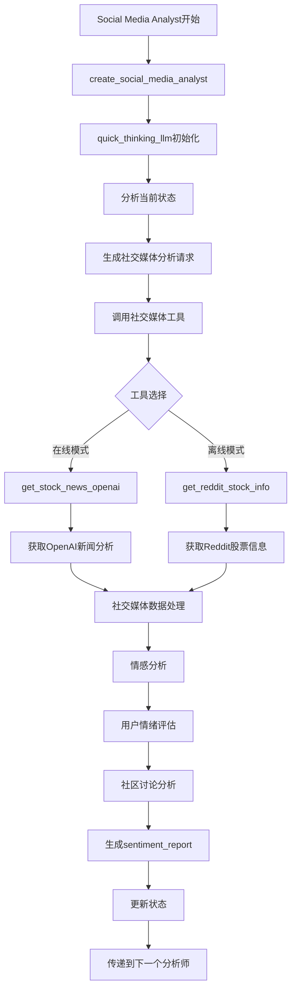
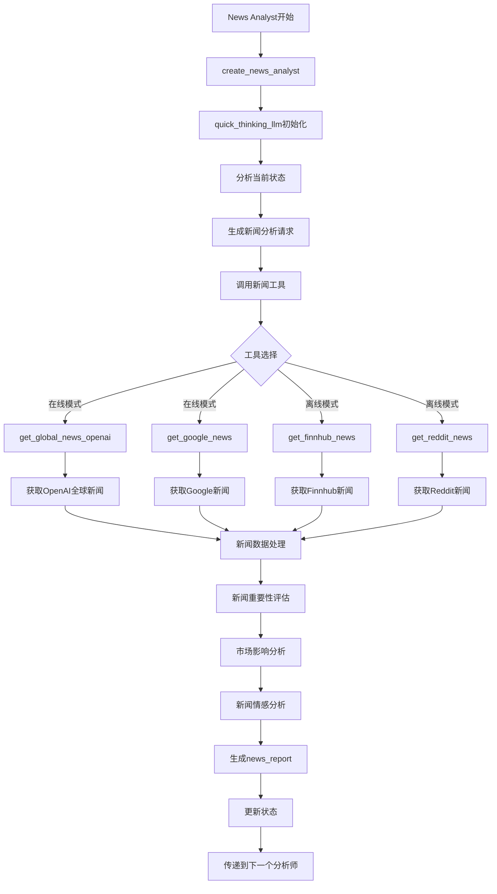
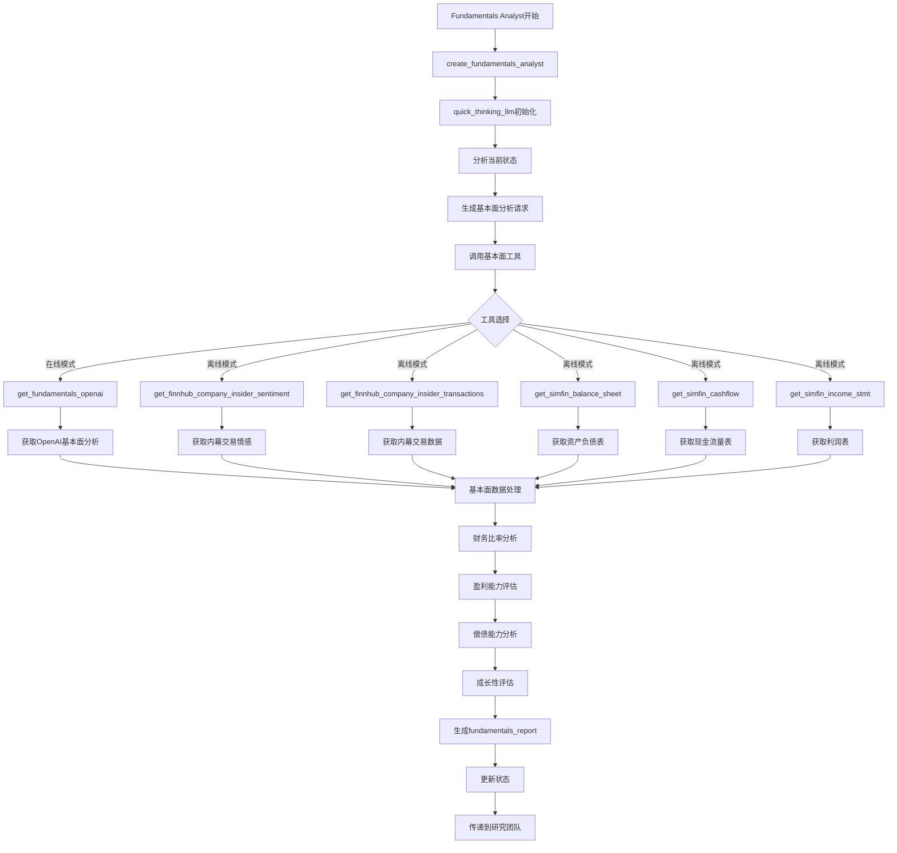

# 3. 分析师团队详细流程

## 3.1 分析师团队整体流程

## 3.2 市场分析师详细流程

## 3.3 社交媒体分析师详细流程

## 3.4 新闻分析师详细流程

## 3.5 基本面分析师详细流程

## 关键函数和类说明：

### 分析师创建函数：
- `create_market_analyst(quick_thinking_llm, toolkit)`: 创建市场分析师
- `create_social_media_analyst(quick_thinking_llm, toolkit)`: 创建社交媒体分析师
- `create_news_analyst(quick_thinking_llm, toolkit)`: 创建新闻分析师
- `create_fundamentals_analyst(quick_thinking_llm, toolkit)`: 创建基本面分析师

### 工具函数：
- `get_YFin_data_online()`: 在线获取YFin数据
- `get_stockstats_indicators_report_online()`: 在线获取StockStats指标
- `get_stock_news_openai()`: 获取OpenAI股票新闻
- `get_reddit_stock_info()`: 获取Reddit股票信息
- `get_global_news_openai()`: 获取OpenAI全球新闻
- `get_google_news()`: 获取Google新闻
- `get_fundamentals_openai()`: 获取OpenAI基本面分析
- `get_simfin_*()`: 获取SimFin财务报表数据

### 状态更新：
- `market_report`: 市场分析报告
- `sentiment_report`: 社交媒体情感报告
- `news_report`: 新闻分析报告
- `fundamentals_report`: 基本面分析报告 