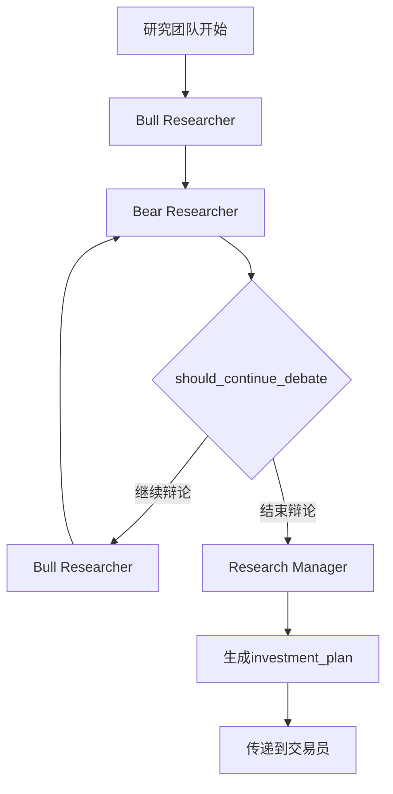
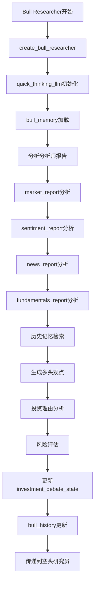
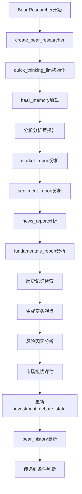
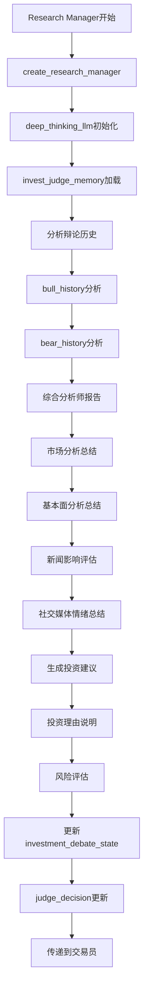

# 4. 研究团队详细流程

## 4.1 研究团队整体流程



## 4.2 多头研究员详细流程



## 4.3 空头研究员详细流程



## 4.4 研究经理详细流程



## 4.5 辩论控制流程

```mermaid
flowchart TD
    A[辩论开始] --> B[investment_debate_state初始化]
    B --> C[count: 0]
    C --> D[history: ""]
    D --> E[current_response: ""]
    E --> F[Bull Researcher分析]
    F --> G[count++]
    G --> H[current_response更新]
    H --> I[should_continue_debate判断]
    I --> J{count >= 2 * max_debate_rounds?}
    J -->|否| K{current_response以"Bull"开头?}
    K -->|是| L[Bear Researcher]
    K -->|否| M[Bull Researcher]
    J -->|是| N[Research Manager]
    L --> O[count++]
    M --> O
    N --> P[辩论结束]
    O --> I
```

## 关键函数和类说明：

### 研究员创建函数：
- `create_bull_researcher(quick_thinking_llm, bull_memory)`: 创建多头研究员
- `create_bear_researcher(quick_thinking_llm, bear_memory)`: 创建空头研究员
- `create_research_manager(deep_thinking_llm, invest_judge_memory)`: 创建研究经理

### 条件逻辑函数：
- `should_continue_debate(state)`: 判断是否继续辩论
  - 检查 `investment_debate_state["count"] >= 2 * max_debate_rounds`
  - 检查 `current_response` 是否以 "Bull" 开头

### 状态管理：
- `investment_debate_state`: 投资辩论状态
  - `history`: 辩论历史
  - `current_response`: 当前回应
  - `count`: 辩论轮数
  - `bull_history`: 多头历史
  - `bear_history`: 空头历史
  - `judge_decision`: 判断决策

### 记忆系统：
- `bull_memory`: 多头研究员记忆
- `bear_memory`: 空头研究员记忆
- `invest_judge_memory`: 投资判断记忆

### 输出：
- `investment_plan`: 投资计划
- `trader_investment_plan`: 交易员投资计划 