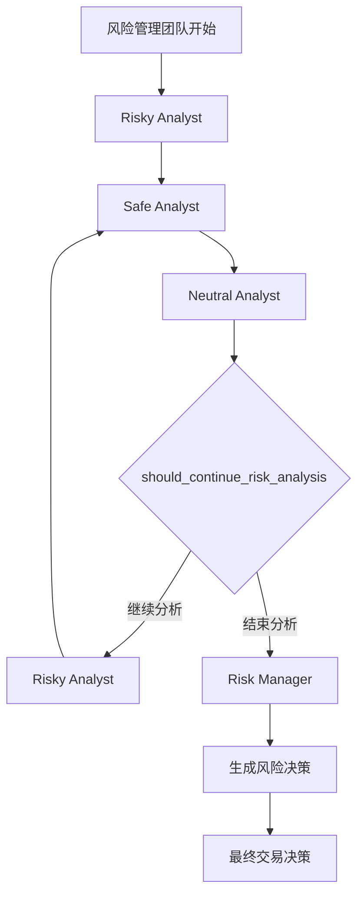
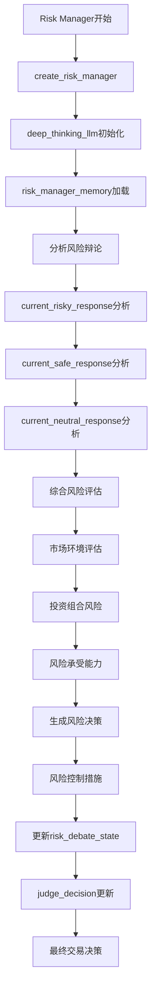

# 5. 风险管理团队详细流程

## 5.1 风险管理团队整体流程



## 5.2 激进分析师详细流程

```mermaid
flowchart TD
    A[Risky Analyst开始] --> B[create_risky_debator]
    B --> C[quick_thinking_llm初始化]
    C --> D[分析投资计划]
    D --> E[trader_investment_plan分析]
    E --> F[风险评估]
    F --> G[激进策略分析]
    G --> H[高风险高回报评估]
    H --> I[市场波动性分析]
    I --> J[杠杆策略考虑]
    J --> K[生成激进观点]
    K --> L[更新risk_debate_state]
    L --> M[current_risky_response更新]
    M --> N[latest_speaker: "Risky"]
    N --> O[传递到保守分析师]
```

## 5.3 保守分析师详细流程

```mermaid
flowchart TD
    A[Safe Analyst开始] --> B[create_safe_debator]
    B --> C[quick_thinking_llm初始化]
    C --> D[分析投资计划]
    D --> E[trader_investment_plan分析]
    E --> F[保守策略分析]
    F --> G[低风险策略评估]
    G --> H[资金保护策略]
    H --> I[防御性投资]
    I --> J[风险规避分析]
    J --> K[生成保守观点]
    K --> L[更新risk_debate_state]
    L --> M[current_safe_response更新]
    M --> N[latest_speaker: "Safe"]
    N --> O[传递到中性分析师]
```

## 5.4 中性分析师详细流程

```mermaid
flowchart TD
    A[Neutral Analyst开始] --> B[create_neutral_debator]
    B --> C[quick_thinking_llm初始化]
    C --> D[分析投资计划]
    D --> E[trader_investment_plan分析]
    E --> F[平衡策略分析]
    F --> G[中等风险评估]
    G --> H[多元化策略]
    H --> I[风险收益平衡]
    I --> J[市场中性策略]
    J --> K[生成中性观点]
    K --> L[更新risk_debate_state]
    L --> M[current_neutral_response更新]
    M --> N[latest_speaker: "Neutral"]
    N --> O[传递到条件判断]
```

## 5.5 风险经理详细流程



## 5.6 风险分析控制流程

```mermaid
flowchart TD
    A[风险分析开始] --> B[risk_debate_state初始化]
    B --> C[count: 0]
    C --> D[history: ""]
    D --> E[current_risky_response: ""]
    E --> F[current_safe_response: ""]
    F --> G[current_neutral_response: ""]
    G --> H[latest_speaker: ""]
    H --> I[Risky Analyst分析]
    I --> J[count++]
    J --> K[latest_speaker: "Risky"]
    K --> L[should_continue_risk_analysis判断]
    L --> M{count >= 3 * max_risk_discuss_rounds?}
    M -->|否| N{latest_speaker以"Risky"开头?}
    N -->|是| O[Safe Analyst]
    N -->|否| P{latest_speaker以"Safe"开头?}
    P -->|是| Q[Neutral Analyst]
    P -->|否| R[Risky Analyst]
    M -->|是| S[Risk Manager]
    O --> T[count++]
    Q --> T
    R --> T
    S --> U[风险分析结束]
    T --> L
```

## 关键函数和类说明：

### 风险分析师创建函数：
- `create_risky_debator(quick_thinking_llm)`: 创建激进分析师
- `create_safe_debator(quick_thinking_llm)`: 创建保守分析师
- `create_neutral_debator(quick_thinking_llm)`: 创建中性分析师
- `create_risk_manager(deep_thinking_llm, risk_manager_memory)`: 创建风险经理

### 条件逻辑函数：
- `should_continue_risk_analysis(state)`: 判断是否继续风险分析
  - 检查 `risk_debate_state["count"] >= 3 * max_risk_discuss_rounds`
  - 检查 `latest_speaker` 的值

### 状态管理：
- `risk_debate_state`: 风险辩论状态
  - `history`: 辩论历史
  - `current_risky_response`: 激进分析师回应
  - `current_safe_response`: 保守分析师回应
  - `current_neutral_response`: 中性分析师回应
  - `count`: 分析轮数
  - `latest_speaker`: 最后发言者
  - `judge_decision`: 风险判断决策

### 记忆系统：
- `risk_manager_memory`: 风险管理记忆

### 输出：
- `final_trade_decision`: 最终交易决策 