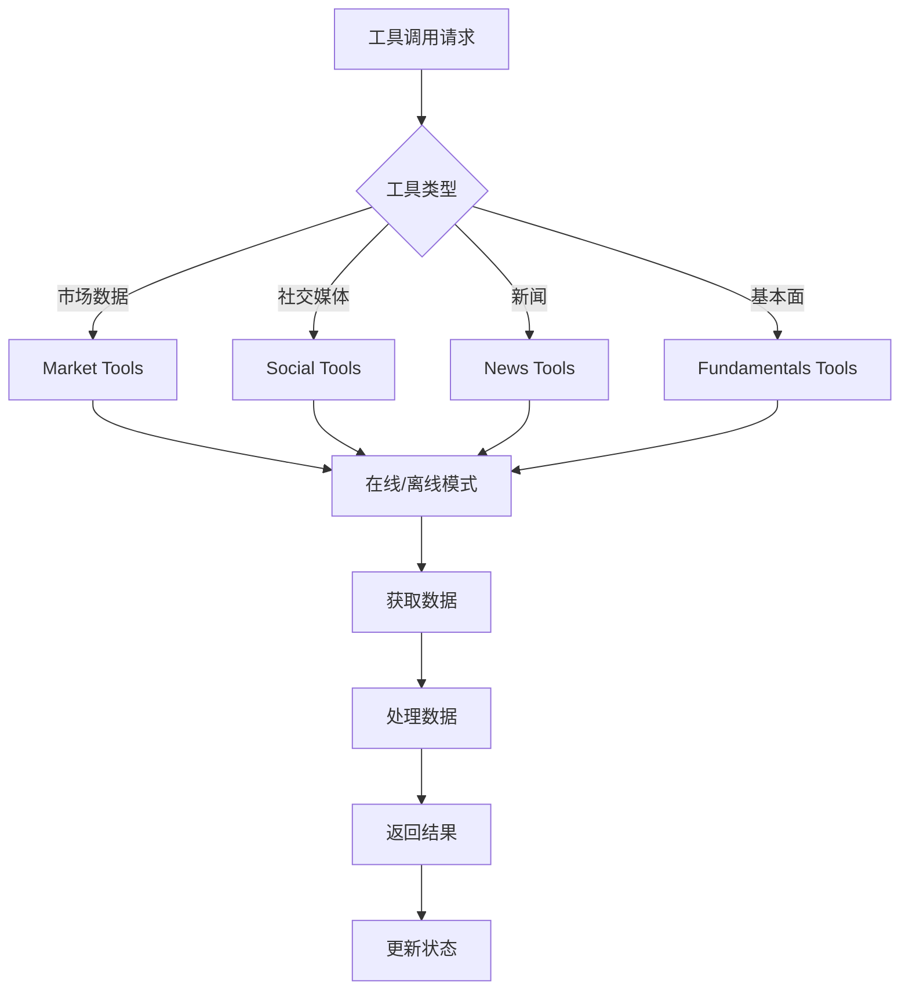
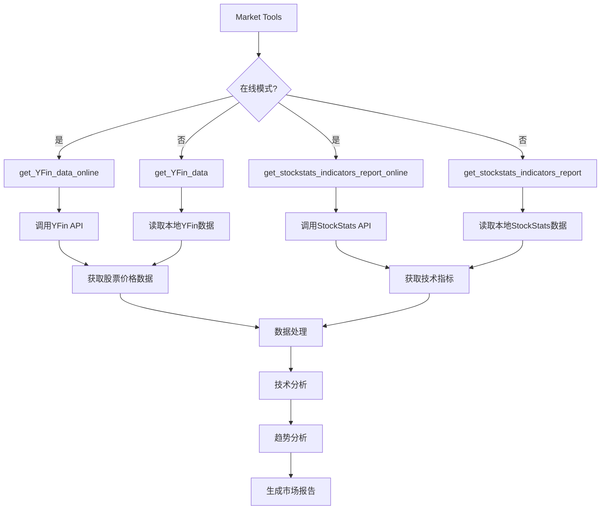
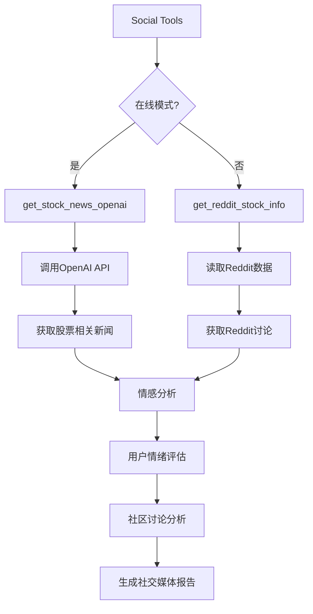
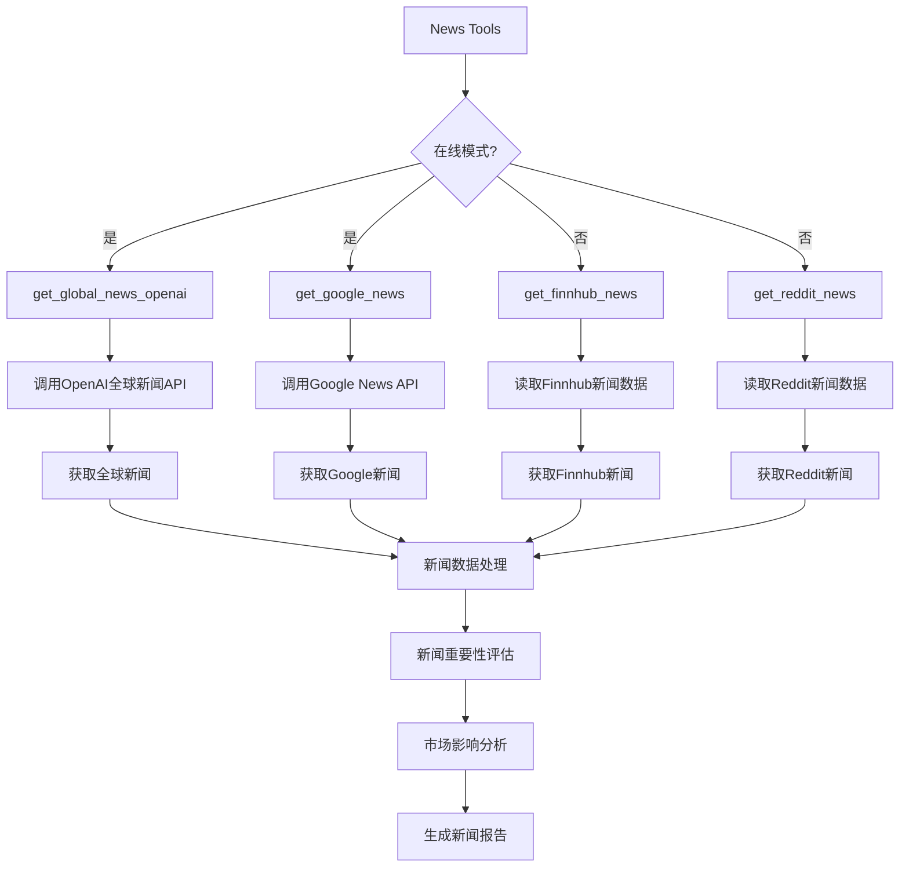
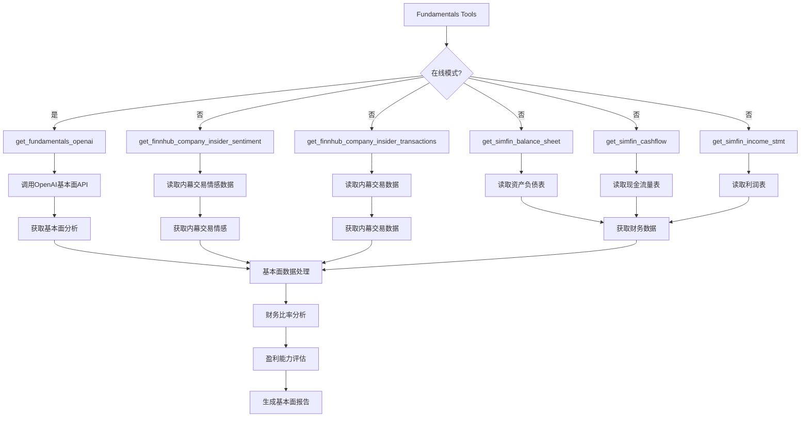
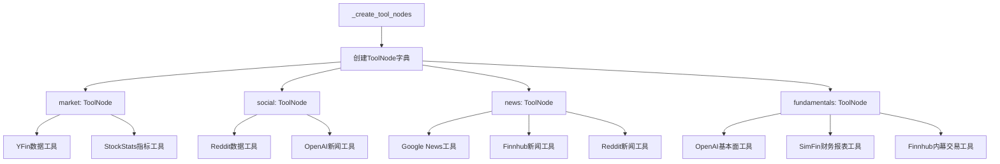

# 6. 工具调用流程

## 6.1 工具调用整体流程

## 6.2 市场数据工具流程

## 6.3 社交媒体工具流程

## 6.4 新闻工具流程

## 6.5 基本面工具流程

## 6.6 工具节点创建流程

## 关键函数和类说明：

### 工具节点类：
- `ToolNode`: LangGraph工具节点类
- `_create_tool_nodes()`: 创建工具节点的方法

### 市场数据工具：
- `get_YFin_data_online()`: 在线获取YFin数据
- `get_stockstats_indicators_report_online()`: 在线获取StockStats指标
- `get_YFin_data()`: 离线获取YFin数据
- `get_stockstats_indicators_report()`: 离线获取StockStats指标

### 社交媒体工具：
- `get_stock_news_openai()`: 获取OpenAI股票新闻
- `get_reddit_stock_info()`: 获取Reddit股票信息

### 新闻工具：
- `get_global_news_openai()`: 获取OpenAI全球新闻
- `get_google_news()`: 获取Google新闻
- `get_finnhub_news()`: 获取Finnhub新闻
- `get_reddit_news()`: 获取Reddit新闻

### 基本面工具：
- `get_fundamentals_openai()`: 获取OpenAI基本面分析
- `get_finnhub_company_insider_sentiment()`: 获取内幕交易情感
- `get_finnhub_company_insider_transactions()`: 获取内幕交易数据
- `get_simfin_balance_sheet()`: 获取资产负债表
- `get_simfin_cashflow()`: 获取现金流量表
- `get_simfin_income_stmt()`: 获取利润表

### 数据源：
- **YFin**: Yahoo Finance数据
- **StockStats**: 技术指标数据
- **Reddit**: 社交媒体讨论
- **Google News**: 新闻数据
- **Finnhub**: 金融数据API
- **SimFin**: 财务报表数据
- **OpenAI**: AI分析服务 