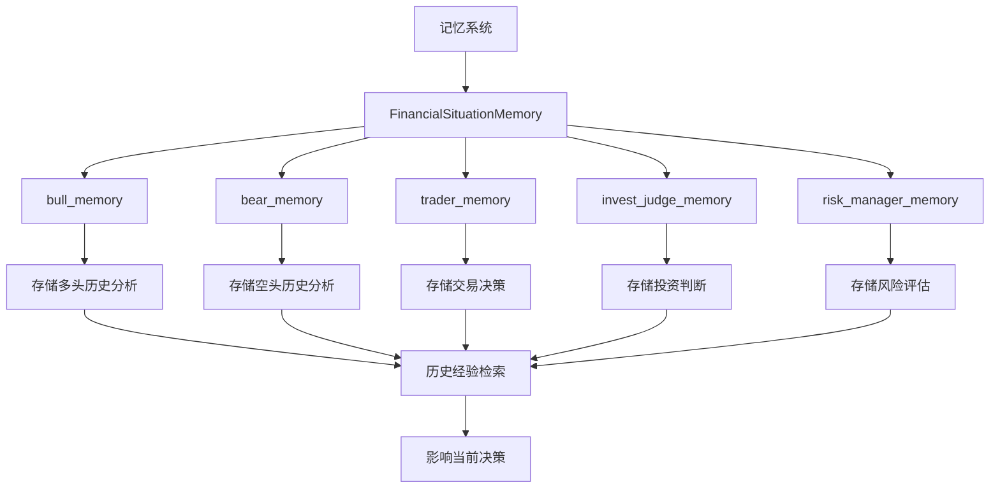
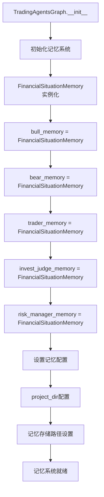
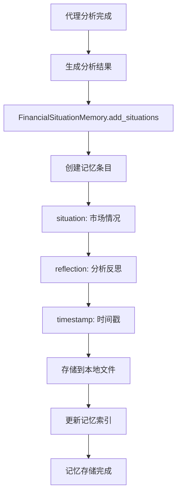
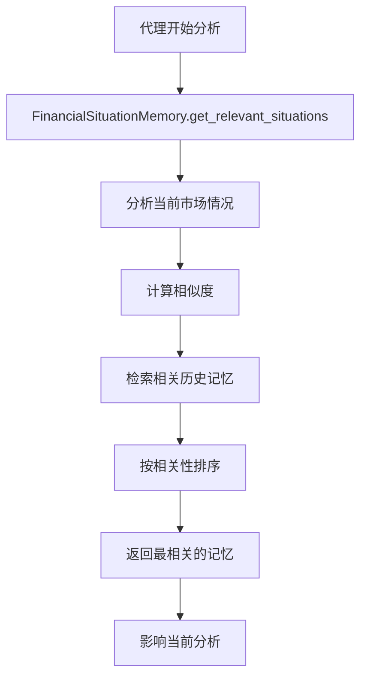
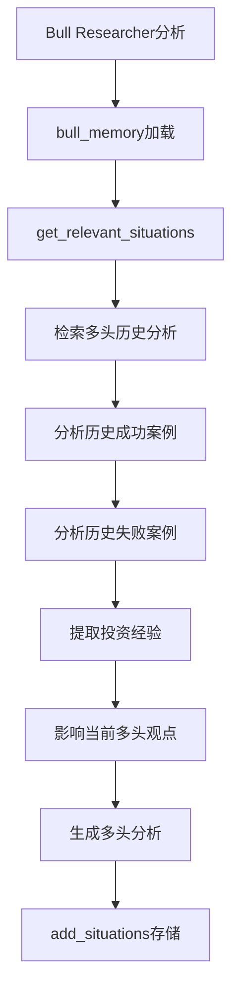
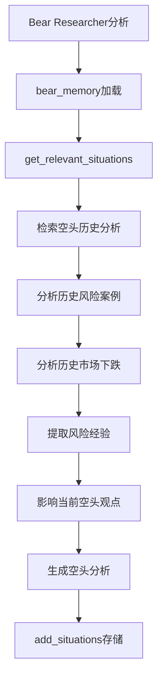
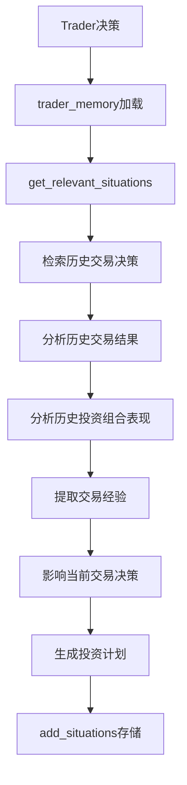
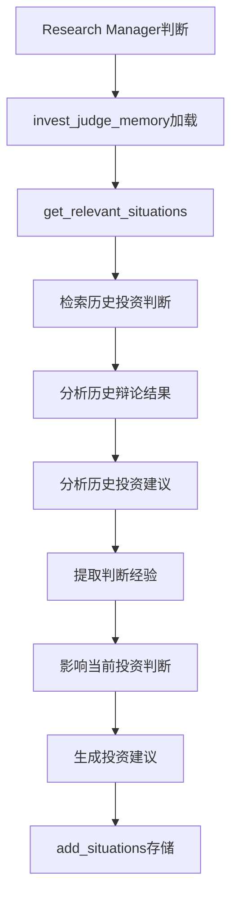
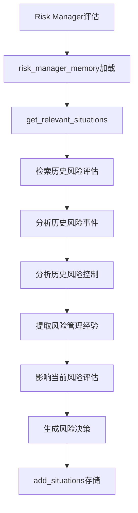
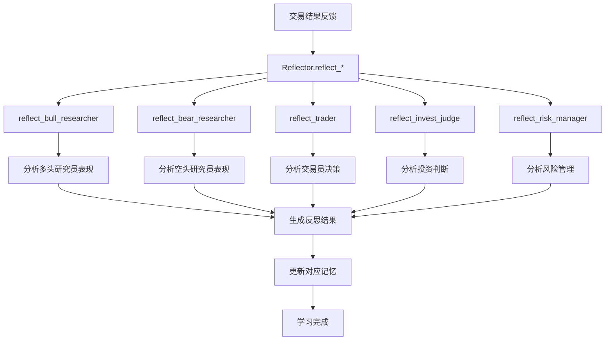

 # 7. 记忆系统流程

## 7.1 记忆系统整体架构

## 7.2 记忆系统初始化流程

## 7.3 记忆存储流程

## 7.4 记忆检索流程

## 7.5 多头记忆流程

## 7.6 空头记忆流程

## 7.7 交易员记忆流程

## 7.8 投资判断记忆流程

## 7.9 风险管理记忆流程

## 7.10 反思学习流程

## 关键函数和类说明：

### 记忆系统类：
- `FinancialSituationMemory`: 财务情况记忆类
  - `__init__(memory_name, config)`: 初始化记忆
  - `add_situations(situations)`: 添加记忆条目
  - `get_relevant_situations(situation, top_k=5)`: 检索相关记忆

### 记忆实例：
- `bull_memory`: 多头研究员记忆
- `bear_memory`: 空头研究员记忆
- `trader_memory`: 交易员记忆
- `invest_judge_memory`: 投资判断记忆
- `risk_manager_memory`: 风险管理记忆

### 反思函数：
- `Reflector.reflect_bull_researcher()`: 反思多头研究员
- `Reflector.reflect_bear_researcher()`: 反思空头研究员
- `Reflector.reflect_trader()`: 反思交易员
- `Reflector.reflect_invest_judge()`: 反思投资判断
- `Reflector.reflect_risk_manager()`: 反思风险管理

### 记忆存储：
- 记忆以JSON格式存储在本地文件
- 包含situation（情况）、reflection（反思）、timestamp（时间戳）
- 支持相似度检索和相关性排序

### 学习机制：
- 基于交易结果进行反思
- 分析成功和失败的原因
- 提取经验教训
- 更新记忆以改进未来决策