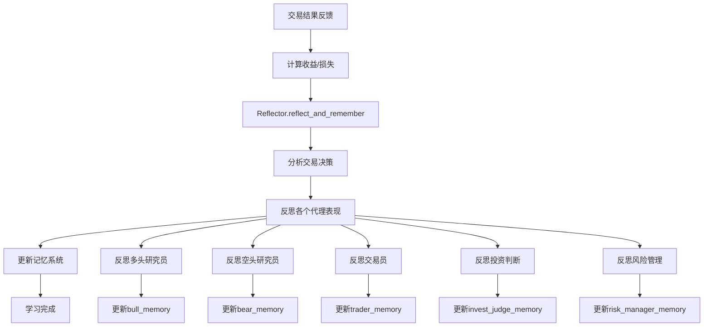
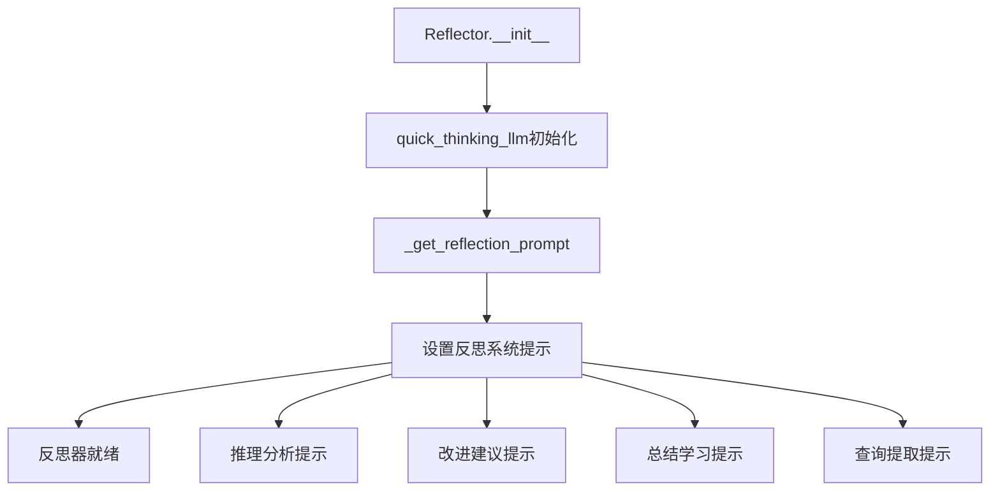
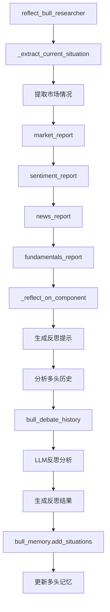
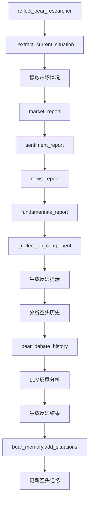
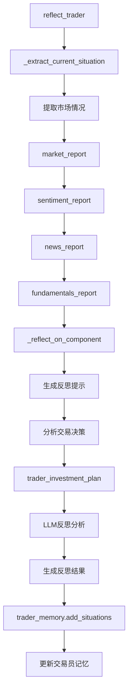
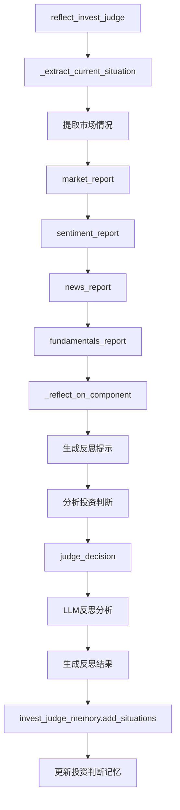
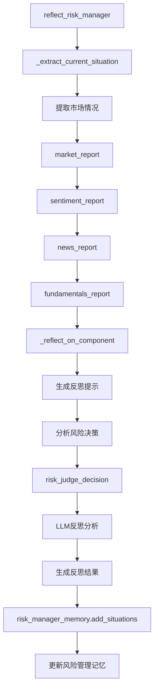
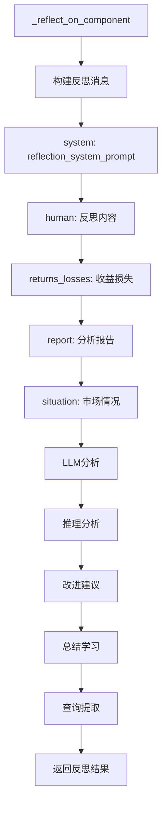
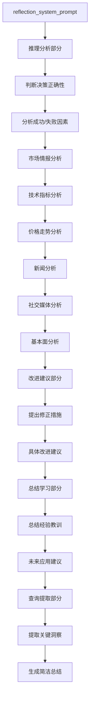

# 8. 反思和学习机制

## 8.1 反思学习整体流程

## 8.2 反思器初始化流程

## 8.3 多头研究员反思流程

## 8.4 空头研究员反思流程

## 8.5 交易员反思流程

## 8.6 投资判断反思流程

## 8.7 风险管理反思流程

## 8.8 反思组件分析流程

## 8.9 反思系统提示词

## 关键函数和类说明：

### 反思器类：
- `Reflector`: 反思学习类
  - `__init__(quick_thinking_llm)`: 初始化反思器
  - `_get_reflection_prompt()`: 获取反思提示词
  - `_extract_current_situation(current_state)`: 提取当前市场情况
  - `_reflect_on_component(component_type, report, situation, returns_losses)`: 反思组件

### 反思函数：
- `reflect_bull_researcher(current_state, returns_losses, bull_memory)`: 反思多头研究员
- `reflect_bear_researcher(current_state, returns_losses, bear_memory)`: 反思空头研究员
- `reflect_trader(current_state, returns_losses, trader_memory)`: 反思交易员
- `reflect_invest_judge(current_state, returns_losses, invest_judge_memory)`: 反思投资判断
- `reflect_risk_manager(current_state, returns_losses, risk_manager_memory)`: 反思风险管理

### 反思分析内容：
- **推理分析**: 判断决策正确性，分析影响因素
- **改进建议**: 提出具体修正措施
- **总结学习**: 提取经验教训
- **查询提取**: 生成关键洞察总结

### 学习机制：
- 基于交易结果进行系统性反思
- 分析各个代理的表现和贡献
- 提取可复用的经验教训
- 更新记忆以改进未来决策质量 