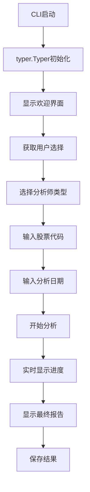
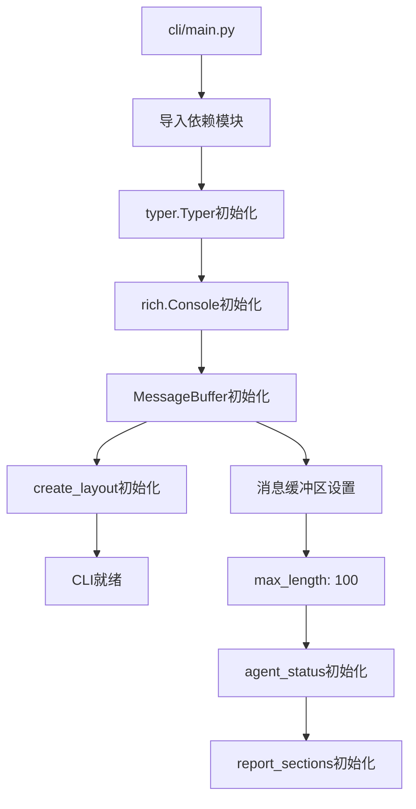
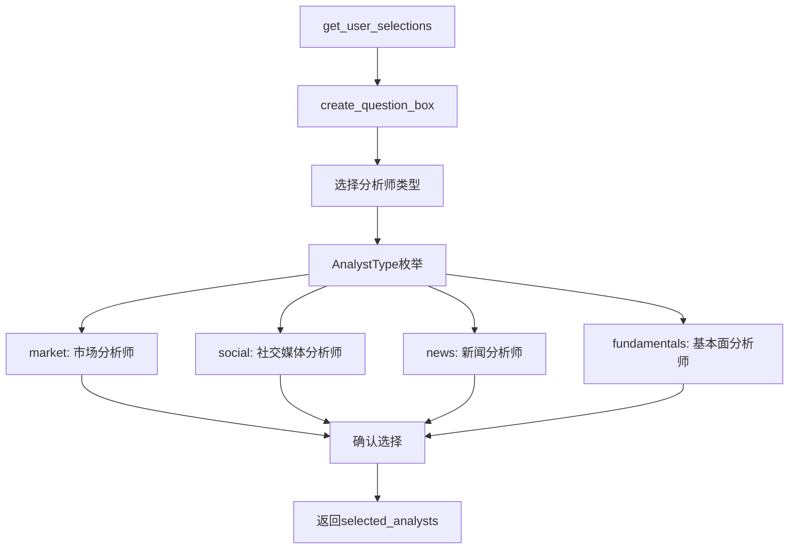
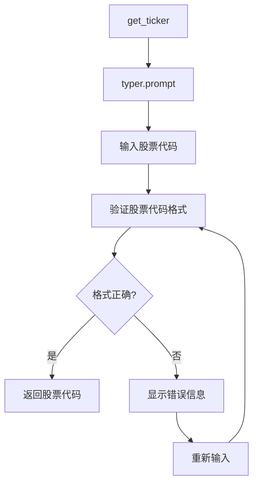
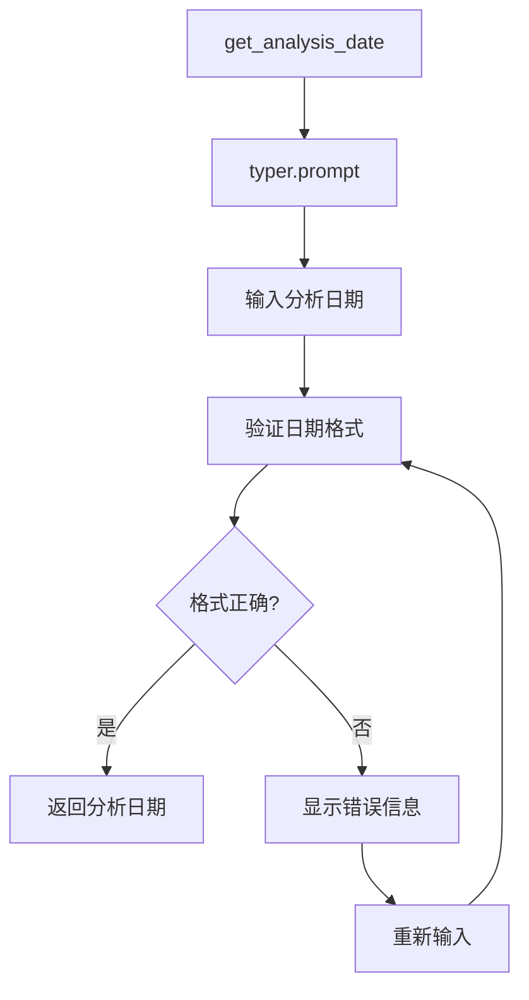
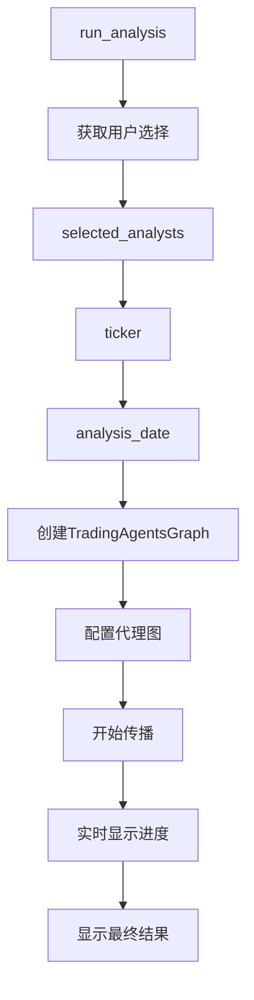
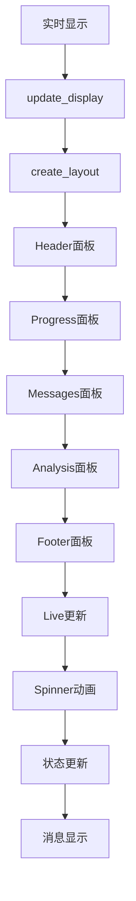
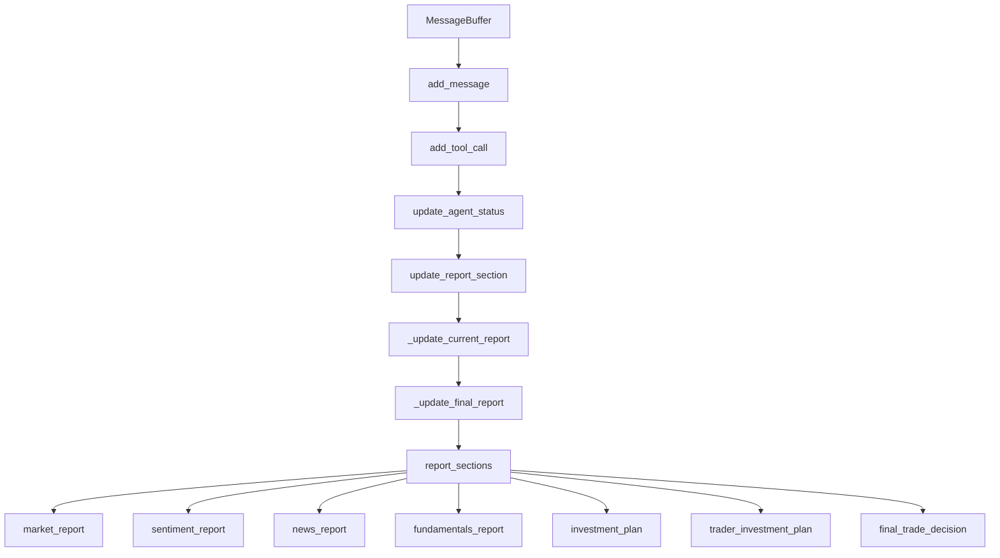
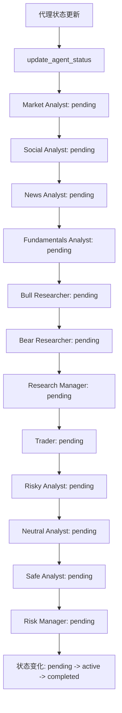
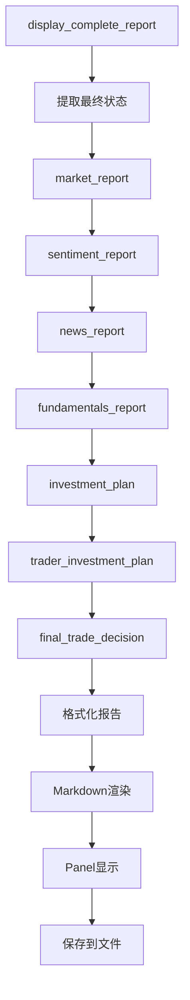

# 9. CLI界面流程

## 9.1 CLI界面整体流程

## 9.2 CLI初始化流程

## 9.3 用户选择流程

## 9.4 股票代码输入流程

## 9.5 分析日期输入流程

## 9.6 分析执行流程

## 9.7 实时显示流程

## 9.8 消息缓冲区流程

## 9.9 代理状态更新流程

## 9.10 报告显示流程

## 关键函数和类说明：

### CLI主类：
- `typer.Typer`: CLI框架
- `rich.Console`: 富文本控制台
- `MessageBuffer`: 消息缓冲区类

### 用户交互函数：
- `get_user_selections()`: 获取用户选择
- `get_ticker()`: 获取股票代码
- `get_analysis_date()`: 获取分析日期
- `create_question_box()`: 创建问题框

### 显示函数：
- `create_layout()`: 创建布局
- `update_display()`: 更新显示
- `display_complete_report()`: 显示完整报告
- `update_agent_status()`: 更新代理状态

### 分析执行函数：
- `run_analysis()`: 运行分析
- `save_message_decorator()`: 消息保存装饰器
- `save_tool_call_decorator()`: 工具调用保存装饰器
- `save_report_section_decorator()`: 报告部分保存装饰器

### 枚举类型：
- `AnalystType`: 分析师类型枚举
  - `market`: 市场分析师
  - `social`: 社交媒体分析师
  - `news`: 新闻分析师
  - `fundamentals`: 基本面分析师

### 状态管理：
- `agent_status`: 代理状态字典
- `report_sections`: 报告部分字典
- `messages`: 消息队列
- `tool_calls`: 工具调用队列

### 布局组件：
- `Header`: 标题面板
- `Progress`: 进度面板
- `Messages`: 消息面板
- `Analysis`: 分析面板
- `Footer`: 底部面板 