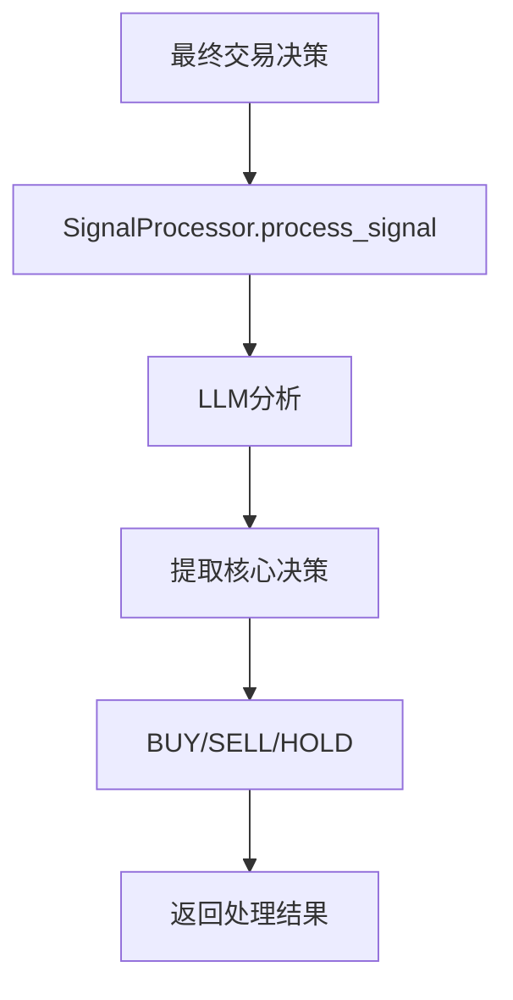
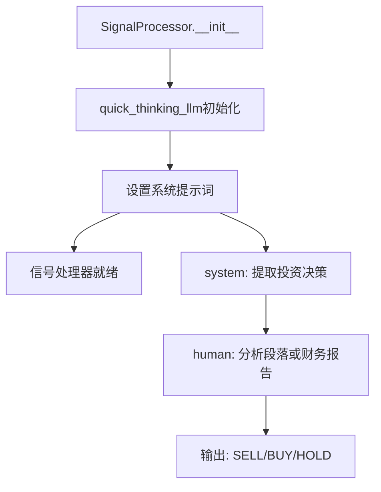
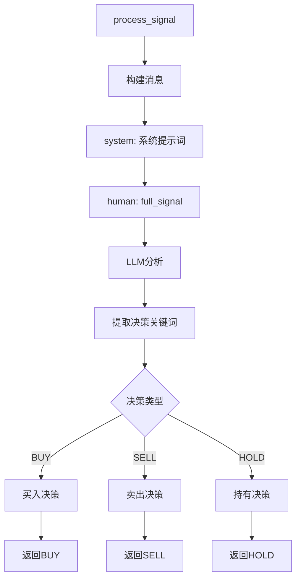
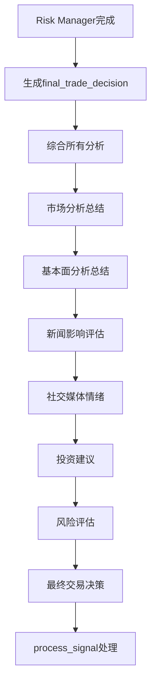
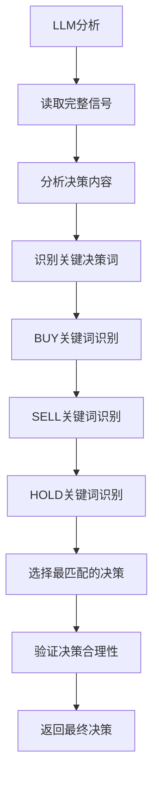
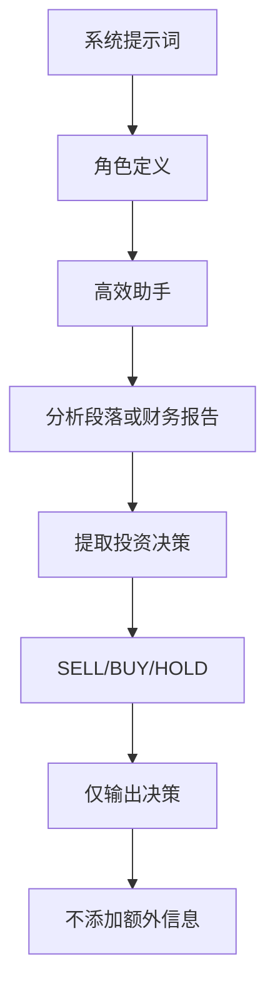
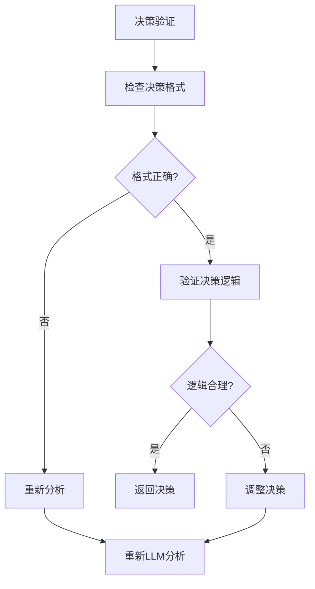
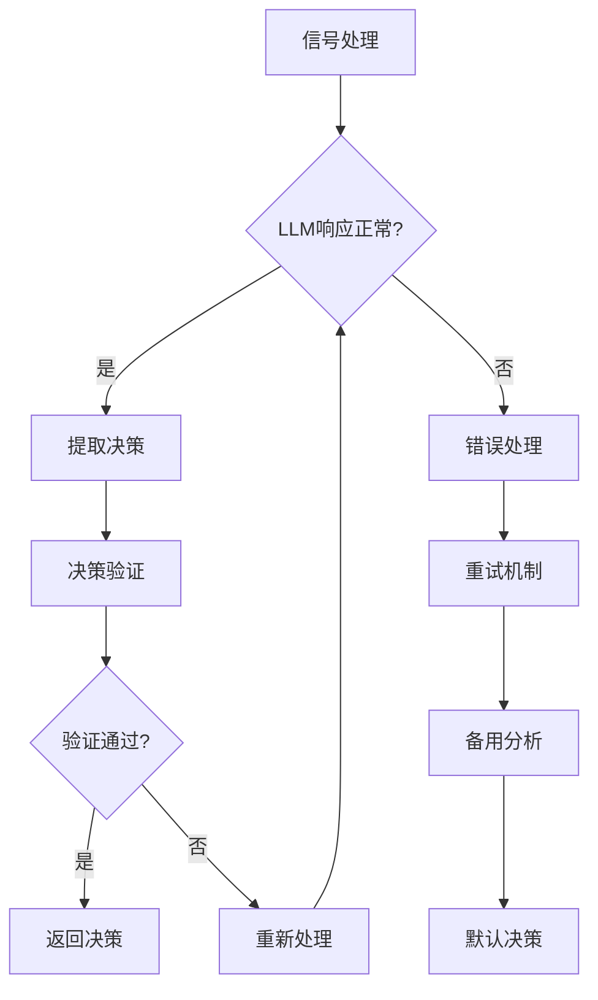

# 10. 信号处理流程

## 10.1 信号处理整体流程



## 10.2 信号处理器初始化流程



## 10.3 信号处理详细流程



## 10.4 最终决策生成流程



## 10.5 决策提取流程



## 10.6 信号处理系统提示词



## 10.7 决策验证流程



## 10.8 信号处理错误处理



## 关键函数和类说明：

### 信号处理器类：
- `SignalProcessor`: 信号处理类
  - `__init__(quick_thinking_llm)`: 初始化信号处理器
  - `process_signal(full_signal)`: 处理完整信号

### 核心函数：
- `process_signal(full_signal: str) -> str`: 处理交易信号
  - 输入: 完整的交易信号文本
  - 输出: 提取的决策 (BUY, SELL, 或 HOLD)

### 系统提示词：
```
You are an efficient assistant designed to analyze paragraphs or financial reports provided by a group of analysts. Your task is to extract the investment decision: SELL, BUY, or HOLD. Provide only the extracted decision (SELL, BUY, or HOLD) as your output, without adding any additional text or information.
```

### 处理流程：
1. **输入**: 完整的交易决策文本
2. **分析**: LLM分析决策内容
3. **提取**: 识别关键决策词
4. **验证**: 确保决策格式正确
5. **输出**: 返回标准化的决策

### 决策类型：
- **BUY**: 买入决策
- **SELL**: 卖出决策
- **HOLD**: 持有决策

### 错误处理：
- LLM响应异常处理
- 决策格式验证
- 重试机制
- 备用分析策略

### 集成点：
- 与 `TradingAgentsGraph.propagate()` 集成
- 与 `Risk Manager` 最终决策集成
- 与 CLI 显示系统集成 