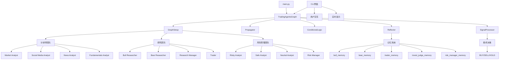

# TradingAgents 程序完整流程图总览

## 流程图文件列表

本目录包含了TradingAgents程序的10个详细流程图，每个都标注了原始程序中的具体函数和类名：

### 1. [程序初始化阶段](01_initialization_flow.md)
- **主要类**: `TradingAgentsGraph`, `GraphSetup`, `Propagator`, `ConditionalLogic`, `Reflector`, `SignalProcessor`
- **关键函数**: `__init__()`, `_create_tool_nodes()`, `setup_graph()`, `set_config()`
- **记忆系统**: `FinancialSituationMemory` 的5个实例

### 2. [主要运行流程](02_main_execution_flow.md)
- **主要函数**: `propagate()`, `create_initial_state()`, `get_graph_args()`
- **代理创建**: `create_*_analyst()`, `create_*_researcher()`, `create_*_debator()`
- **条件逻辑**: `should_continue_*()` 系列函数

### 3. [分析师团队详细流程](03_analyst_team_flow.md)
- **分析师创建**: `create_market_analyst()`, `create_social_media_analyst()`, `create_news_analyst()`, `create_fundamentals_analyst()`
- **工具函数**: `get_YFin_data_online()`, `get_stockstats_indicators_report_online()`, `get_stock_news_openai()`, `get_reddit_stock_info()`, `get_global_news_openai()`, `get_google_news()`, `get_fundamentals_openai()`, `get_simfin_*()`
- **状态更新**: `market_report`, `sentiment_report`, `news_report`, `fundamentals_report`

### 4. [研究团队详细流程](04_research_team_flow.md)
- **研究员创建**: `create_bull_researcher()`, `create_bear_researcher()`, `create_research_manager()`
- **条件逻辑**: `should_continue_debate()`
- **状态管理**: `investment_debate_state`, `bull_history`, `bear_history`, `judge_decision`
- **记忆系统**: `bull_memory`, `bear_memory`, `invest_judge_memory`

### 5. [风险管理团队详细流程](05_risk_management_flow.md)
- **风险分析师创建**: `create_risky_debator()`, `create_safe_debator()`, `create_neutral_debator()`, `create_risk_manager()`
- **条件逻辑**: `should_continue_risk_analysis()`
- **状态管理**: `risk_debate_state`, `current_risky_response`, `current_safe_response`, `current_neutral_response`, `latest_speaker`
- **记忆系统**: `risk_manager_memory`

### 6. [工具调用流程](06_tool_calls_flow.md)
- **工具节点**: `ToolNode`, `_create_tool_nodes()`
- **数据源**: YFin, StockStats, Reddit, Google News, Finnhub, SimFin, OpenAI
- **在线/离线模式**: 支持在线API调用和离线数据读取

### 7. [记忆系统流程](07_memory_system_flow.md)
- **记忆类**: `FinancialSituationMemory`
- **记忆实例**: `bull_memory`, `bear_memory`, `trader_memory`, `invest_judge_memory`, `risk_manager_memory`
- **核心函数**: `add_situations()`, `get_relevant_situations()`

### 8. [反思和学习机制](08_reflection_learning_flow.md)
- **反思器类**: `Reflector`
- **反思函数**: `reflect_bull_researcher()`, `reflect_bear_researcher()`, `reflect_trader()`, `reflect_invest_judge()`, `reflect_risk_manager()`
- **辅助函数**: `_extract_current_situation()`, `_reflect_on_component()`, `_get_reflection_prompt()`

### 9. [CLI界面流程](09_cli_interface_flow.md)
- **CLI框架**: `typer.Typer`, `rich.Console`
- **消息缓冲**: `MessageBuffer`
- **用户交互**: `get_user_selections()`, `get_ticker()`, `get_analysis_date()`
- **显示函数**: `create_layout()`, `update_display()`, `display_complete_report()`
- **枚举类型**: `AnalystType`

### 10. [信号处理流程](10_signal_processing_flow.md)
- **信号处理器**: `SignalProcessor`
- **核心函数**: `process_signal()`
- **决策类型**: BUY, SELL, HOLD
- **系统提示词**: 专门用于提取投资决策的LLM提示

## 程序架构关系图

## 关键组件说明

### 核心控制器
- **TradingAgentsGraph**: 主控制器，协调整个系统
- **GraphSetup**: 构建代理图和工作流
- **Propagator**: 处理状态传播和初始化

### 代理团队
1. **分析师团队**: 负责数据收集和分析
2. **研究团队**: 负责投资决策制定
3. **风险管理团队**: 负责风险评估和控制

### 支持系统
- **记忆系统**: 存储和检索历史经验
- **反思系统**: 从交易结果中学习
- **信号处理**: 提取最终交易决策
- **CLI界面**: 用户交互和显示

### 数据流
1. **输入**: 股票代码 + 交易日期
2. **分析**: 四个分析师依次分析
3. **研究**: 多头空头辩论，研究经理总结
4. **交易**: 交易员制定计划
5. **风险**: 三个风险分析师评估，风险经理决策
6. **输出**: 最终交易决策 (BUY/SELL/HOLD)

## 使用说明

这些流程图可以帮助理解：
- 程序的完整运行流程
- 各个组件之间的协作关系
- 具体的函数调用和类实例化
- 数据流向和状态变化
- 错误处理和异常情况

每个流程图都标注了原始代码中的具体函数名和类名，便于对照代码进行理解和调试。 